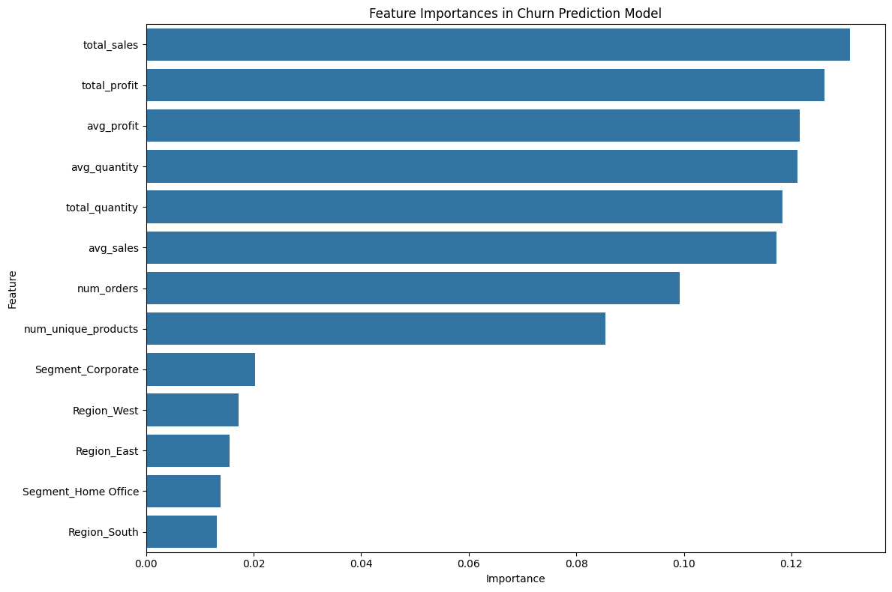
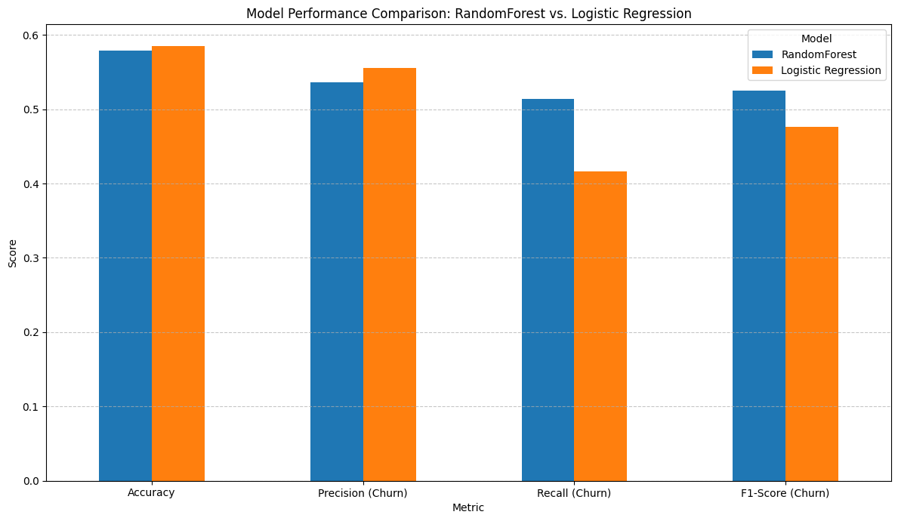
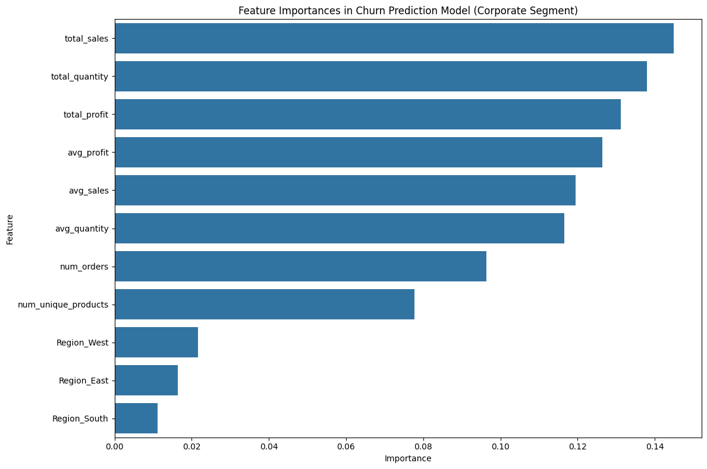

# Customer-Churn-Prediction
Predicting customer churn using transactional sales data with RandomForest and Logistic Regression models.
# Customer Churn Prediction Project

## Project Objective
To predict customer churn based on a transactional sales dataset (`sample_superstore.csv`), evaluate model performance, identify key churn drivers, and provide actionable strategies for customer retention.

## Methodology
*   **Data Loading & Inspection:** Loaded `sample_superstore.csv`, converted date formats, and inspected for missing values.
*   **Churn Definition:** Defined churn as a customer not making a purchase within a 90-day inactivity period from the most recent order date in the dataset.
*   **Feature Engineering:** Aggregated transactional data to the customer level to create features such as total sales, average profit, number of orders, and unique products. Categorical features (`Segment`, `Region`) were one-hot encoded.
*   **Model Building & Evaluation:** Trained and evaluated `RandomForestClassifier` and `LogisticRegression` models. Hyperparameter tuning was performed for the RandomForest model.
*   **Feature Importance Analysis:** Identified the most influential factors contributing to churn for the overall customer base and specifically for the 'Corporate' segment.
*   **Model Comparison:** Compared the performance of the tuned RandomForest and Logistic Regression models using accuracy, precision, recall, and F1-score.
*   **Actionable Strategies & Validation:** Discussed insights from feature importance to propose retention strategies and explained the role of A/B testing and customer feedback for validation and deeper understanding.

## Key Findings
*   **Churn Rate:** Based on the 90-day inactivity threshold, approximately **45% of customers were classified as churned** (357 out of 793 unique customers).
*   **Key Churn Drivers:** Financial metrics (`total_sales`, `total_profit`, `avg_sales`, `avg_profit`) and customer engagement metrics (`total_quantity`, `avg_quantity`, `num_orders`, `num_unique_products`) were the most significant predictors of churn across the board. Regional and segment-specific factors had comparatively lower but still present importance.
*   **Model Performance:**
    *   **Tuned RandomForest:** Achieved an accuracy of **57.86%**. Demonstrated better **recall (51.39%)** and **F1-score (52.48%)** for the churn class, indicating a better ability to identify actual churners.
    *   **Logistic Regression:** Achieved a slightly higher overall accuracy of **58.49%** but had lower recall (41.67%) and F1-score (47.62%) for the churn class.
*   **Segment-Specific Insights (Corporate):** The churn drivers for the Corporate segment largely mirrored the overall trends, with financial and transactional volume metrics remaining paramount. This reinforces the idea that these are fundamental aspects of customer loyalty.

## Actionable Insights & Recommendations
*   **Prioritize Financial & Engagement Metrics:** Closely monitor customer activity related to sales, profit, quantity purchased, and order frequency. Declining trends in these areas should trigger immediate intervention.
*   **Targeted Retention Campaigns:** Develop personalized offers and engagement strategies for customers identified as 'at-risk' by the churn prediction model, particularly those showing reduced financial contribution or activity.
*   **Strategic Model Selection:** If the primary business goal is to identify as many potential churners as possible (to intervene proactively), the **RandomForest model** is likely more suitable due to its higher recall for the churn class. If overall accuracy is paramount, Logistic Regression performs marginally better.
*   **Integrate Qualitative Feedback:** Supplement quantitative insights with qualitative data (e.g., exit surveys, customer service feedback) to understand the underlying reasons for churn, which can inform more effective strategies.
*   **A/B Test Interventions:** Validate the effectiveness of any retention strategies through rigorous A/B testing to ensure interventions have a statistically significant positive impact.
*   **Continuous Monitoring & Improvement:** Churn prediction is an iterative process. Regularly update models with new data, re-evaluate feature importance, and adapt retention strategies based on ongoing performance and market changes.

## Key Visualizations
*(To add visualizations, you will need to save the plots as image files (e.g., PNG, JPEG) from your Colab notebook or by taking screenshots and then upload them to your GitHub repository. Once uploaded, you can link them here. For example:)*

### Feature Importances in Churn Prediction Model

### Model Performance Comparison

### Feature Importances for Corporate Segment

